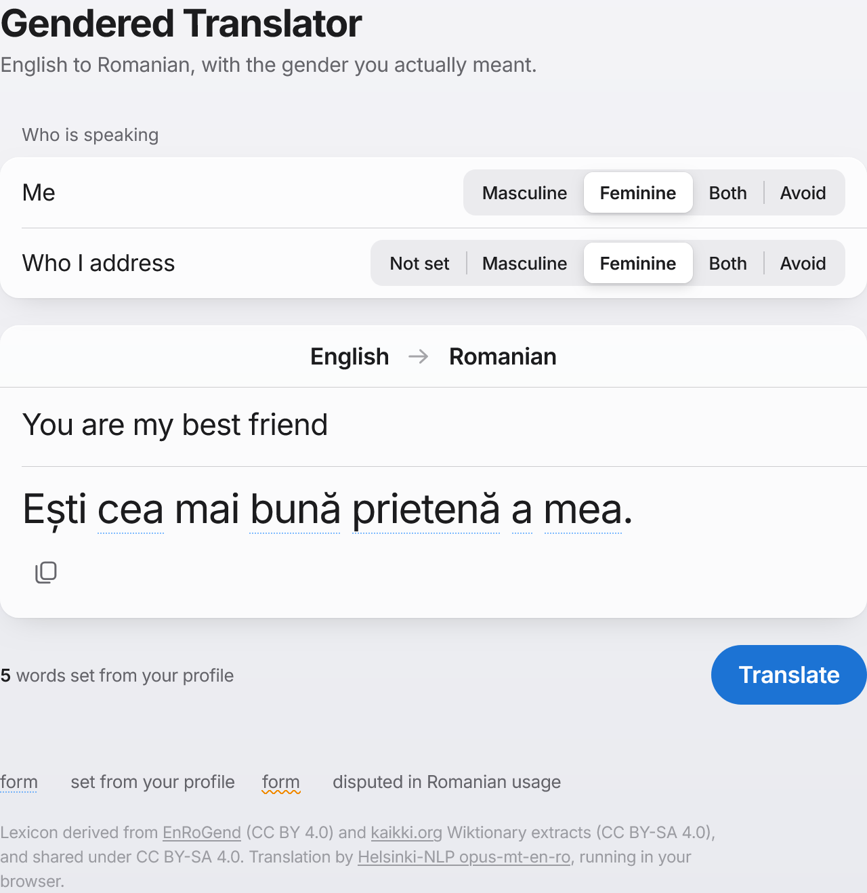

# Acord

[](https://github.com/NStrumberger/Acord/actions/workflows/deploy.yml)

English → Romanian translation that gets **grammatical gender** right.
Runs entirely in your browser. No server, no account, works offline.

**→ [nstrumberger.github.io/Acord](https://nstrumberger.github.io/Acord/)**



## The problem

English hides information Romanian requires. "I am tired" carries no gender;
Romanian forces a choice on the adjective. Every general translator resolves
this silently, and machine translation resolves it *arbitrarily* — the same
model gives `Sunt obosit` for the speaker and `Ești obosită` for the person
addressed, with nothing in the English to justify either.

It is rarely one word, either. "You're my best friend" said to a woman changes
five:

```
Ești cel mai bun prieten al meu.   →   Ești cea mai bună prietenă a mea.
```

Article, superlative, noun, possessive article and possessive all agree with
the subject. Half-correcting it is worse than not correcting it.

## What it does differently

- **You say who is in the sentence; your choice leads.** A name is never
  evidence — asked about `Alex`, `Sam` and `Jordan`, the model guessed masculine
  every time, which is the exact default this exists to correct. An explicit
  *he* or *she* in the English **is** evidence, and is kept.
- **Everybody named gets their own control.** "Josh is my friend and Maya is
  also my friend" puts a row against each name, so they can differ. A name only
  earns a row when something in the Romanian actually agrees with it — offering
  a control that changes nothing would be worse than offering none. Those rows
  are per sentence and are never remembered: a name is not a person, and two
  people called Alex need not match.
- **It tells you when "correct" is disputed.** Romanian professional feminines
  are not settled: DOOM3 admits both `filologă` and `filoloagă`, and
  *doamna inginer* still competes with *ingineră*. Those forms are marked, with
  the reason.
- **It will not invent a form.** Romanian inflects for two grammatical genders,
  so there is no third to print. Non-binary output shows both forms, or avoids
  gender entirely where the language allows — `Sunt profesor` becomes `Predau`,
  a verb that carries no gender at all.
- **Nothing is derived at runtime.** Rule-based feminine derivation was measured
  at 78% against attested data, and the errors are well-formed Romanian words
  that are simply the wrong one. The lexicon is curated; an unknown word is a
  miss, not a guess. See [`notes/R0-findings.md`](notes/R0-findings.md).

## Install it on your phone or iPad

Open the site in Safari, then **Share → Add to Home Screen**. It installs with
its own icon and opens full-screen.

The first translation on a device downloads the model (~113 MB, quantised) and
takes 10–15 seconds. After that everything is local: no network, no server.

## How it works

```
English  →  opus-mt-en-ro (ONNX, in-browser)  →  Romanian
                                                    ↓
                                    post-editor: find the predicate spans,
                                    set each person's gender from your
                                    choice, flag disputed forms
```

Translation is `Xenova/opus-mt-en-ro` under `transformers.js`. The gender layer
is original: a reverse index over stored paradigms, and a span analyser that
decides whose gender each word follows. A copula opens a span to the end of its
clause, because a Romanian predicate agrees throughout — article, superlative,
noun, possessive article and possessive together.

The `notes/` directory records what was measured and what was got wrong,
including the enclitic article rules validating at 100% against corpus data
while feminine derivation reached only 78% — which is why one is derived and
the other is a table.

## Development

Node ≥ 22.6 runs the TypeScript directly, so the engine needs no build step.
Python 3 is only needed for the build-time lexicon pipeline.

```
npm run dev            # http://localhost:5173
npm test               # typecheck + node --test (no test framework)
npm run build          # static build into dist/
npm run shots          # screenshot Firefox at 3 breakpoints, both themes
npm run check:webkit   # translate in WebKit, the engine iOS Safari uses
npm run check:offline  # service worker + offline shell
npm run check:people   # per-person rows end to end (needs npm run dev)
npm run check:update   # a deploy reaches an already-installed app
```

Rebuilding the lexicon (needs Python 3, downloads ~155 MB of corpora):

```
npm run data:extract   # occupation pairs from EnRoGend
npm run data:kaikki    # paradigms + feminine equivalents from kaikki.org
npm run data:build     # merge both sources → curated lexicon
npm run data:spike     # re-measure rule-derivability
npm run data:validate  # check article rules against the corpus
```

## Licence

Code is MIT. The lexicon is **CC BY-SA 4.0**, because it derives from
kaikki.org's Wiktionary extracts and ShareAlike attaches — see
[`DATA-LICENSE.md`](DATA-LICENSE.md). The app carries attribution in its footer
for that reason.
